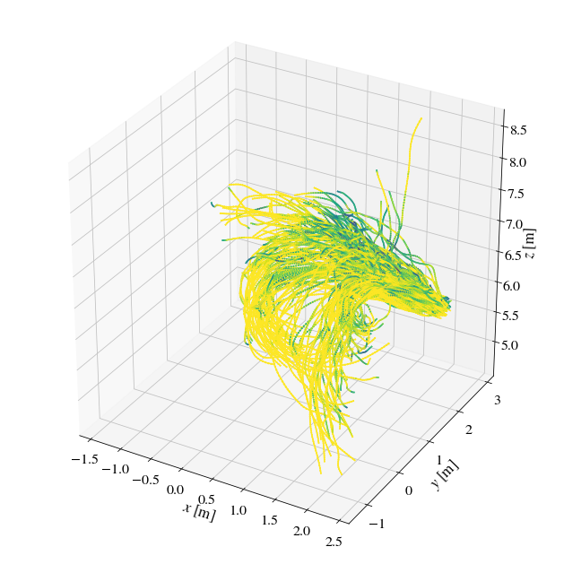

# flowtracks_examples

## Getting Started (Local Setup)

Clone the repository:
```bash
git clone https://github.com/openptv/flowtracks_examples.git
cd flowtracks_examples
```

Install *uv* (if not already installed):


Install dependencies and sync environment using uv:
```bash
uv pip install --upgrade pip
uv sync
```

## Running the Examples

To run the main script:
```bash
uv marimo edit marimo_notebooks/gallery.py
```

## Viewing Jupyter Notebooks Locally

If you want to run Jupyter notebooks, install Jupyter with uv:
```bash
uv pip install jupyter
```
Then launch Jupyter:
```bash
uv pip run jupyter notebook
```
Open the `jupyter_notebooks` folder and run any notebook.

## Optional: Jupyter Notebooks

If you want to run Jupyter notebooks, install Jupyter with uv:

```bash
uv pip install jupyter
```

Then launch Jupyter:

```bash
uv pip run jupyter notebook
```

Open the `jupyter_notebooks` folder and run any notebook.

## Test Data

Test data is available in the `test_data` folder.
## Example Notebooks and Online Viewing

Flowtracks documentation: https://flowtracks.readthedocs.io/en/latest/

### View Notebooks Online

You can view the example notebooks directly on molab.marimo.io:

1. Go to https://molab.marimo.io
2. Click "Open from GitHub"
3. Enter the repository URL: `https://github.com/openptv/flowtracks_examples`
4. Browse and open any notebook from the `jupyter_notebooks` folder

Alternatively, see the notebooks on nbviewer:
https://nbviewer.jupyter.org/github/alexlib/flowtracks_examples/tree/master/

Or run using MyBinder.org:

[](https://mybinder.org/v2/gh/alexlib/flowtracks_examples/master?labpath=plotting_trajectories_using_postptv.ipynb)

## Additional Examples by Ron Shnapp
See Ron Shnapp's work on Lagrangian plotting on BitBucket:
https://bitbucket.org/ronshnapp/lagrangian_plotting_library/src/master/

Preview notebook:
[Tutorials notebook](https://nbviewer.jupyter.org/urls/bitbucket.org/ronshnapp/lagrangian_plotting_library/raw/1253baf5593ab9604584d5219c2de5d14ebb59c3/Tutorials.ipynb)



