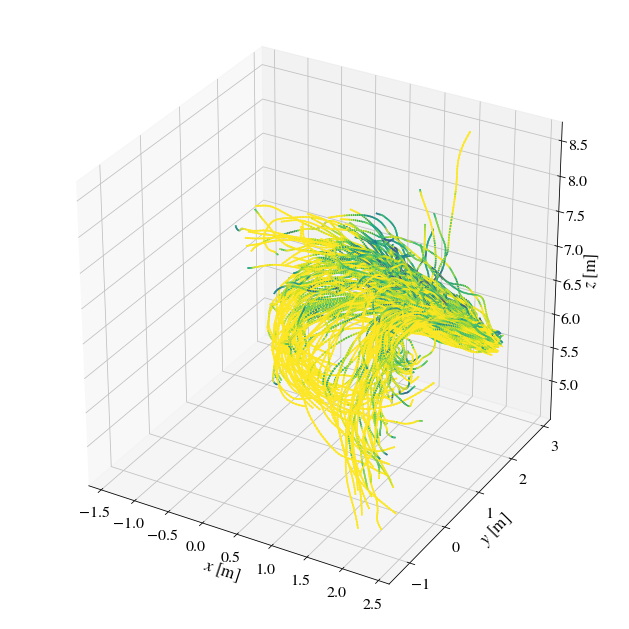

# 🌊 flowtracks_examples

[](https://www.python.org/)
[](https://marimo.io)
[](https://zarr.dev)
[](https://github.com/astral-sh/uv)
[](https://github.com/openptv)

A gallery of **[marimo](https://marimo.io)** interactive notebooks and workflows for **[flowtracks](https://github.com/openptv/postptv)** (PostPTV) — 3D Particle Tracking Velocimetry (3D-PTV) post-processing, kinematic analysis, interactive Plotly visualization, and cloud-native **Zarr** data containers.

---

## 🚀 Quick Start

### ⚡ Online Cloud Run (Zero Setup via molab)

Run the interactive gallery and notebooks directly in your browser without installing anything locally via **[molab.marimo.io](https://molab.marimo.io)**:

1. Launch **[molab.marimo.io](https://molab.marimo.io)**
2. Click **"Open from GitHub"**
3. Enter repository: `https://github.com/openptv/flowtracks_examples`
4. Select `index.py` (or any notebook in `notebooks/`) to run instantly in WASM/Sandbox mode!

---

### 💻 Local Setup (using `uv`)

1. **Clone the repository**:
   ```bash
   git clone https://github.com/openptv/flowtracks_examples.git
   cd flowtracks_examples
   ```

2. **Sync environment**:
   ```bash
   uv sync
   ```

3. **Launch the Marimo Gallery & Library Index**:
   ```bash
   # Launch as an interactive web application
   uv run marimo run index.py

   # Or open in interactive editor mode
   uv run marimo edit index.py
   ```

*(If developing alongside `postptv`, `pyproject.toml` is pre-configured with `[tool.uv.sources]` pointing to `../postptv`)*

---

## 📂 Notebook Catalog

The library includes 19 interactive marimo notebooks categorized by stage:

### 📦 Data Loading & Zarr
- **[flowtracks_load_data_to_hdf_and_plot3d.py](notebooks/flowtracks_load_data_to_hdf_and_plot3d.py)**: Load data from text, HDF, or Zarr sources and export to cloud-native `.zarr` stores.
- **[marimo_aorta_flowtracks.py](notebooks/marimo_aorta_flowtracks.py)**: End-to-end 3D cardiac aortic flow processing driving smoothing and Eulerian binning from `run.zarr`.
- **[plotting_trajectories_using_postptv.py](notebooks/plotting_trajectories_using_postptv.py)**: Auto-detect Zarr stores, HDF5, or `ptv_is` text files.
- **[plotting_2d_trajectories_using_openptv_postptv.py](notebooks/plotting_2d_trajectories_using_openptv_postptv.py)**: 2D XY projection of trajectories.
- **[postptv_EX3915.py](notebooks/postptv_EX3915.py)**: Ingest PTVis trajectory files, compute velocity/acceleration arrays, and plot PDFs.
- **[read_alex_ruiz_data.py](notebooks/read_alex_ruiz_data.py)**: Read v7.3 MAT files using `hdf5storage` and export Trajectory lists to Zarr.
- **[read_alex_ruiz_data-h5py.py](notebooks/read_alex_ruiz_data-h5py.py)**: Read MATLAB datasets directly with `h5py` and convert to PyTables HDF5 & Zarr stores.

### 🎨 Visualization (Plotly & Interactive 3D)
- **[marimo_zarr_dashboard.py](notebooks/marimo_zarr_dashboard.py)**: Interactive Zarr data dashboard inspecting chunked trajectory stores and velocity fields.
- **[plotly_visualize_trajectories_nb.py](notebooks/plotly_visualize_trajectories_nb.py)**: Interactive 3D Plotly trajectory visualizer with time window sliders and speed colormaps.
- **[plotly_3d_trajectories.py](notebooks/plotly_3d_trajectories.py)**: 3D line plot of particle trajectories grouped by ID using Plotly Express.
- **[myptv_visualization.py](notebooks/myptv_visualization.py)**: Render 3D trajectories with speed-dependent Viridis colormapping in Plotly.
- **[plot_frames.py](notebooks/plot_frames.py)**: Plot multi-panel 2D (x-y, y-z) and 3D frame snapshots using Plotly subplots.
- **[animate_trajectories.py](notebooks/animate_trajectories.py)**: Generate high-resolution MP4 video animations of particle tails with camera controls.

### 🔬 Analysis & Scene Studies
- **[pair_analysis_example.py](notebooks/pair_analysis_example.py)**: Pairwise particle trajectory analysis with velocity magnitude 3D scatter plots.
- **[joint_pdf.py](notebooks/joint_pdf.py)**: Compute joint probability density functions (PDF) of velocity vs acceleration.
- **[test_plot_pdf_subplots.py](notebooks/test_plot_pdf_subplots.py)**: Fit Gaussian distributions to particle velocity components and plot subplots.
- **[hdf5_scene_analysis.py](notebooks/hdf5_scene_analysis.py)**: Explore tracer and particle scenes iterating by frame, segment, and trajectory.
- **[linking_trajectories.py](notebooks/linking_trajectories.py)**: Bridge broken trajectory gaps using predictive kinematic velocity matching.
- **[repeated_interpolation.py](notebooks/repeated_interpolation.py)**: Evaluate local velocity interpolation consistency via random subsampling.

---

## 📁 Data Formats

The examples utilize sample data provided in the repository:
- **`test_zarr/`**: Pre-built cloud-native Zarr stores (`trajectories.zarr`).
- **`test_h5/`**: PyTables HDF5 trajectory files (`traj_GT.h5`, `traj_RC.h5`, `test.h5`).
- **`test_data/`**: OpenPTV legacy text output files (`ptv_is.%d`, `xuap.%d`, `trajPoint.%d`).
- **`test_mat/`**: MATLAB v7.3 datasets (`traj_GT.mat`, `traj_RC.mat`).

---

## 🧪 Testing

To run the automated smoke test suite across all data readers, Zarr round-trips, and notebook definitions:

```bash
uv run pytest
```

---

## 🖼️ Preview


